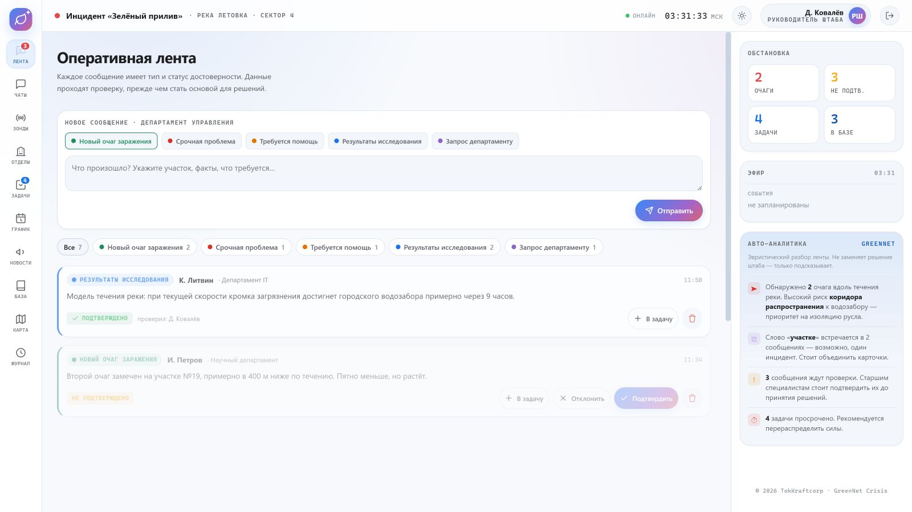
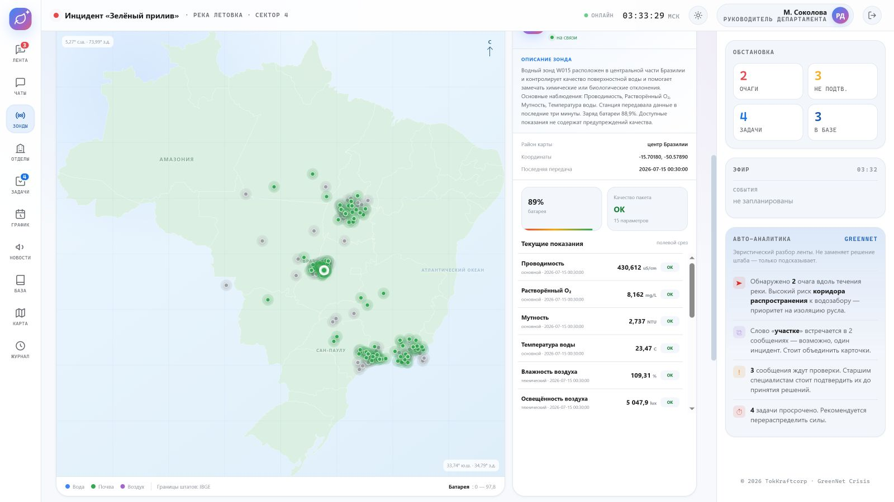

# GreenNet Crisis

[](https://github.com/midqox-cyber/letovo-project-IT-dep/actions/workflows/ci.yml)

Локальная платформа командного реагирования на экологический инцидент: проверяемая
оперативная лента, групповые чаты, задачи, расписание, база знаний и карта 180 зондов
NIMPH на территории Бразилии.

**Документация:** [архитектура](docs/ARCHITECTURE.md) ·
[развёртывание](docs/DEPLOYMENT.md) · [интеграция NIMPH](docs/NIMPH_INTEGRATION.md) ·
[безопасность](SECURITY.md) · [вклад в проект](CONTRIBUTING.md)

Единая платформа управления ликвидацией экологической катастрофы для программы
**«Летово Игра»**. Не просто чат, а система координации кризиса: роли и права,
типизированные сообщения, верификация данных, задачи, база знаний, карта, журнал
событий и авто-аналитика ленты.

Это **серверная версия** (Flask + SQLite) — с настоящим входом по логину и паролю
и правами, которые проверяются на сервере, а не только в интерфейсе.

---

## Интерфейс

| Оперативная лента | Карта сети зондов |
|---|---|
|  |  |

---

## Что умеет

| Система | Описание |
|---|---|
| **Роли и права** | 6 ролей от волонтёра до администратора. Права проверяются на сервере — их нельзя обойти через консоль браузера. |
| **Оперативная лента** | Сообщения 5 типов (🟢 очаг, 🔴 срочно, 🟡 помощь, 🔵 исследование, 🟣 запрос) с фильтрами. |
| **Групповые чаты** | Пользователи создают рабочие комнаты минимум на 3 участников. Личных диалогов нет. |
| **Оповещения** | Колокольчик с историей непрочитанных событий, всплывающие карточки и системные уведомления браузера о новостях, сообщениях, очагах, задачах и расписании. |
| **Верификация** | Данные сначала «не подтверждены», старший специалист/руководитель их подтверждает. |
| **Задачи** | Канбан «Новые → В работе → Выполнено», кастомные задачи с исполнителем и сроком. |
| **База знаний** | Подтверждённые данные автоматически сохраняются навсегда. |
| **Карта** | Очаги, лаборатории, дроны, группы, водозабор, безопасные зоны. |
| **Карта зондов NIMPH** | Полный текущий срез 180 станций воды, почвы и воздуха: реальные координаты, батарея, качество и показания. |
| **Журнал** | Все действия фиксируются с точным временем. |
| **Админ-панель** | Создание пользователей, выдача ролей, департаментов, отключение и удаление. |
| **Онлайн для всех** | Общая база; участники подключаются с разных устройств и видят одно и то же (обновление раз в 5 сек). |

Системные уведомления включаются пользователем в центре уведомлений и работают,
пока сайт открыт в активной или фоновой вкладке. Категории можно включать и
отключать отдельно; выбранные настройки и непрочитанные события сохраняются
локально для каждого аккаунта на конкретном устройстве.

---

## Запуск

### 🖱️ Самый простой способ — по клику

Для обычного локального запуска дважды кликните **`start-local.bat`**. Он создаст локальное
виртуальное окружение, установит Flask и откроет **http://localhost:5000**. База `greennet.db`,
CSV `users.csv` и пароль администратора `admin_password.txt` будут лежать рядом с проектом.

Альтернативный **`start.bat`** сам определит доступный вариант: Docker Desktop или Python.

Браузер откроется автоматически на **http://localhost:5000**. При локальном запуске остановить
сервер можно через `Ctrl+C` или закрытием окна; Docker-вариант останавливается через `stop.bat`.

### 🐳 Через Docker (вручную)

```bash
docker compose up --build      # запуск (Ctrl+C — стоп)
docker compose up --build -d   # запуск в фоне
docker compose down            # остановить
```
Данные (база и аккаунты) хранятся в Docker-томе `greennet-data` и переживают перезапуск.

### 🐍 Через Python (вручную)

Нужен Python 3.9+.

```bash
pip install -r requirements.txt
python app.py
```

Открыть в браузере: **http://localhost:5000**

База данных `greennet.db` и ключ сессий `secret_key.txt` создаются автоматически
при первом запуске. Чтобы начать сценарий заново — остановите сервер, удалите
`greennet.db` и запустите снова (или нажмите «Сбросить сценарий» в админ-панели).

---

## Вход администратора (обычный режим)

По умолчанию приложение запускается в **боевом режиме**: создаётся **только один
админ-аккаунт**, всё остальное пусто (участников создаёт админ через панель).

- **Логин:** `admin` (или значение `GREENNET_ADMIN_USER`).
- **Пароль:** задаётся в `GREENNET_ADMIN_PASSWORD`; если переменная не задана —
  генерируется надёжный пароль и **печатается в консоли** при первом запуске,
  а также сохраняется в файл `admin_password.txt` рядом с базой.

```bash
# задать свой пароль администратора (рекомендуется)
#   Windows PowerShell:  $env:GREENNET_ADMIN_PASSWORD="мой-пароль"; python app.py
#   Linux/Docker:        GREENNET_ADMIN_PASSWORD=... (в docker-compose.yml)
```

Дальше админ входит и создаёт остальных участников в разделе **«Админ»**.

## Демо-режим (показной сценарий)

Чтобы посмотреть готовый пример — инцидент «Зелёный прилив» с игровыми аккаунтами и
наполненной лентой/картой — запустите с переменной **`GREENNET_DEMO=1`**:

```bash
#   Windows PowerShell:
#     $env:GREENNET_DEMO="1"
#     $env:GREENNET_DEMO_PASSWORD="задайте-локально"
#     python app.py
#   Docker: добавьте GREENNET_DEMO=1 и GREENNET_DEMO_PASSWORD в environment
```

В демо-режиме на странице входа появляется список игровых профилей разных ролей.
Общий пароль не хранится в исходном коде: задайте его через
`GREENNET_DEMO_PASSWORD`. Если переменная отсутствует, приложение сгенерирует значение,
покажет его только в локальном терминале и сохранит в игнорируемом файле
`demo_password.txt` рядом с базой. Не включайте демо-режим на публичном сервере.

## Регистрация участников

На странице входа есть вкладка **«Регистрация»** — участники заводят аккаунт сами
(логин, имя, фамилия, департамент, пароль). Данные хранятся в базе, **пароль — только в виде хэша**.

- Новому участнику всегда присваивается роль **«наблюдатель»**.
- **Изменить роль может только администратор** (раздел «Админ»). Самому назначить себе
  роль через регистрацию нельзя — сервер игнорирует поле роли.
- При регистрации обязательно принять **пользовательское соглашение** (пункт о том, что
  вся переписка в системе видна штабу и читается). Момент согласия фиксируется в базе.

Отключить самостоятельную регистрацию: переменная окружения `GREENNET_REGISTRATION=0`
(тогда участников заводит только админ).

---

## Групповые чаты и CSV-датасет

- В разделе **«Чаты»** любой вошедший пользователь может создать рабочую комнату.
- В комнате обязательно не менее **трёх** участников вместе с создателем: создать личный
  диалог или замаскированный чат «один на один» сервер не позволит.
- Создатель становится **главным группы**: он может добавлять участников в уже работающую
  комнату, удалять их и включать или снимать `mute`. Те же права управления участниками
  получают состоящие в группе старшие специалисты, руководители департаментов,
  руководители штаба и администраторы. Пользователь с `mute` видит историю, но не может
  отправлять сообщения; удалить саму группу по-прежнему может только создатель или администратор.
- История и состав групп хранятся в SQLite и синхронизируются между устройствами.
- После первого запуска рядом с базой автоматически создаётся UTF-8 CSV-файл `users.csv`.
  В нём есть логин, имя, фамилия, отображаемое имя, роль, департамент, статус и даты.
- Пароля и `password_hash` в CSV **нет**. Администратор может скачать актуальный датасет
  кнопкой **«CSV пользователей»** в разделе «Админ».

---

## Карта зондов NIMPH

Раздел **«Зонды»** получает полный текущий срез со страницы мониторинга NIMPH и
наносит станции по реальным координатам на карту Бразилии. Контур страны и границы
штатов взяты из официальной упрощённой географической сетки IBGE. Можно:

- фильтровать воду, почву и воздух, искать зонд по ID;
- окрашивать карту по батарее или любому доступному параметру;
- открывать карточку станции с автоматическим описанием её назначения, района,
  состояния связи, батареи, качества и всех показаний;
- вручную обновлять данные; при открытой карте обновление происходит раз в минуту.

Сервер разбирает официальные HTML-карточки `/api/v1/monitor/cards`, потому что
публичный API NIMPH не предоставляет массовый snapshot. Снимки сжимаются и хранятся
в SQLite: если внешний сервис временно недоступен, интерфейс показывает последний
сохранённый срез с предупреждением. Адрес источника можно заменить переменной
`GREENNET_NIMPH_URL` (по умолчанию `http://nimph.fial-corporation.ru`).

---

## Матрица прав (упрощённо)

| Действие | Волонтёр | Специалист | Ст. спец. | Рук. деп. | Рук. штаба | Админ |
|---|:-:|:-:|:-:|:-:|:-:|:-:|
| Сообщать об очаге / просить помощь | ✅ | ✅ | ✅ | ✅ | ✅ | ✅ |
| Отправлять все типы сообщений | — | ✅ | ✅ | ✅ | ✅ | ✅ |
| Подтверждать достоверность | — | — | ✅ | ✅ | ✅ | ✅ |
| Ставить задачи | — | ✅ | ✅ | ✅ | ✅ | ✅ |
| Закрывать задачи | — | — | свои | департамент | все | все |
| Управлять пользователями | — | — | — | — | — | ✅ |

---

## Как играть на нескольких устройствах (в одной сети)

1. Узнайте IP компьютера-сервера: `ipconfig` (Windows) → строка IPv4, например `192.168.1.50`.
2. Запустите `python app.py` (сервер слушает `0.0.0.0:5000` — доступен по сети).
3. Участники в той же Wi-Fi открывают `http://192.168.1.50:5000`.
4. При необходимости разрешите порт 5000 в брандмауэре Windows.

---

## Технологии

- **Backend:** Python + Flask, база данных SQLite (файл `greennet.db`).
- **Пароли:** хэшируются (`werkzeug.security`, PBKDF2) — в базе нет открытых паролей.
- **Датасет:** `users.csv` (UTF-8, обновляется при регистрации и изменениях пользователей).
- **Сессии:** подписанные cookie (HttpOnly).
- **Frontend:** адаптивный интерфейс Google/Gemini в одном `static/index.html` без внешних зависимостей.

## Структура проекта

```
GreenNetCrisis/
├── app.py               # сервер: API, база данных, роли и права
├── requirements.txt     # зависимости (Flask)
├── README.md            # этот файл
├── start-local.bat      # рекомендуемый локальный запуск по клику
├── start.bat            # запуск по клику (Docker или Python)
├── stop.bat             # остановка
├── Dockerfile           # образ приложения
├── docker-compose.yml   # запуск одной командой
├── .dockerignore
├── static/
│   └── index.html       # весь интерфейс
├── greennet.db          # база данных (создаётся при запуске)
├── users.csv            # CSV-датасет профилей без паролей (создаётся при запуске)
└── secret_key.txt       # ключ подписи сессий (создаётся при запуске)
```

## Развёртывание в интернете (кратко)

Для продакшена не используйте встроенный сервер Flask. Варианты:
- **PythonAnywhere** / **Render** / **Railway** — загрузить проект, точка входа `app:app`.
- WSGI-сервер: `pip install gunicorn` и `gunicorn -w 1 --threads 8 app:app`.
  `init_db()` вызывается на уровне модуля, так что отдельная инициализация не нужна.
- ⚠️ Только **один воркер** (`-w 1`): база — SQLite (файл). Для нескольких воркеров
  нужен внешний БД-сервер (PostgreSQL).

## 🔒 Перед публикацией в интернет (обязательно)

Приложение задумано для игры в локальной сети и «из коробки» удобно, но небезопасно
для публичного хостинга. Перед выкладыванием в интернет:

1. **Смените пароль администратора** и удалите/смените демо-аккаунты (пароль `letovo`).
2. **Уберите блок «Демо-доступы»** на странице входа — он публично печатает логины и пароли
   (массив `DEMO` в `static/index.html`).
3. **Включите HTTPS** и переменную окружения `GREENNET_HTTPS=1` — тогда сессионная кука
   получит флаг `Secure` (иначе её можно перехватить по открытому HTTP).
4. **Храните `secret_key.txt` в безопасности** — кто прочитает файл, сможет подделать сессии.
5. Для реального доступа из интернета добавьте ограничение попыток входа (rate limiting)
   и, при усилении требований, CSRF-токены. Для локальной игры это не требуется.

## Лицензия

Copyright © 2026 Костин Михаил Сергеевич (TokKraftcorp). Все права защищены.

Проприетарная лицензия. Полный текст — в файле [LICENSE](LICENSE). Использование,
копирование, изменение и распространение — только с письменного разрешения
правообладателя.
